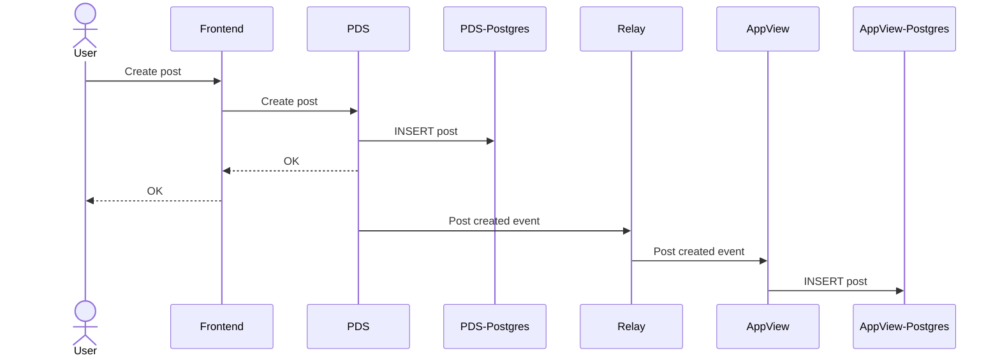
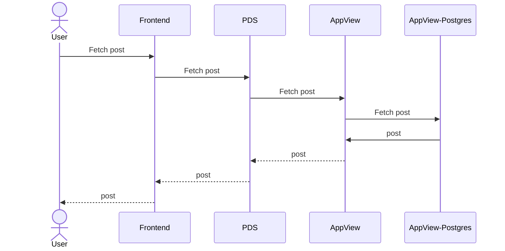
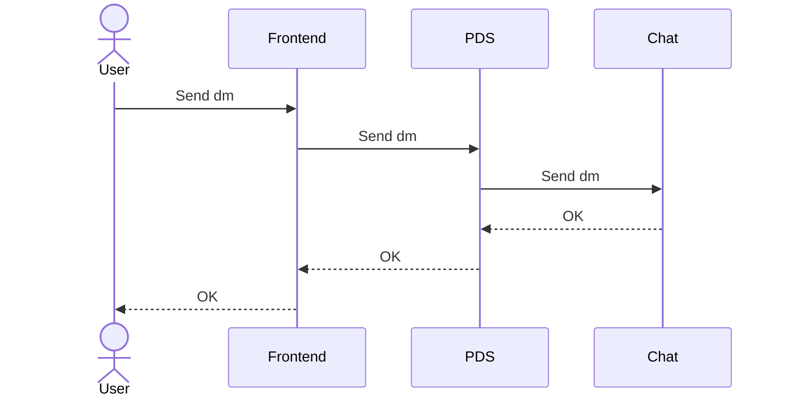

# bsky architecture

Bsky is based on 4 main components:

1. `PDS` - holds all information about users it serves such as posts, likes, replies, etc.
   PSDs are not synchronized in any way, they just proxy requests and maintain user state.
2. `Relay` - subscribes to all available `PSDs` in the network to gather updates (posts, likes, replies, etc.) into a single stream of updates.
3. `AppView` - Consumes all events from `Relay` to build a personal feed for every user and maintain the state of the social network.
4. `ChatAPI` - Stores users' DMs. It's a proprietary extension to `ATProto` created by bsky. The code is not available in open source.

## PDS and AppView interactions

For all writes and updates, `PDS` acts as a primary replica. It always holds the newest information about the users it serves.
All updates are pushed through the `sync` API to `Relay` and later to `AppView`.

"Create post" is an example of such an operation:

In case of reads, `PDS` acts as a proxy to `AppView`.

"Fetch post" is an example of such an operation:

## PDS and Chat interactions

`PDS` acts as a proxy to `Chat API`

Send DM example:

Read DM example:

