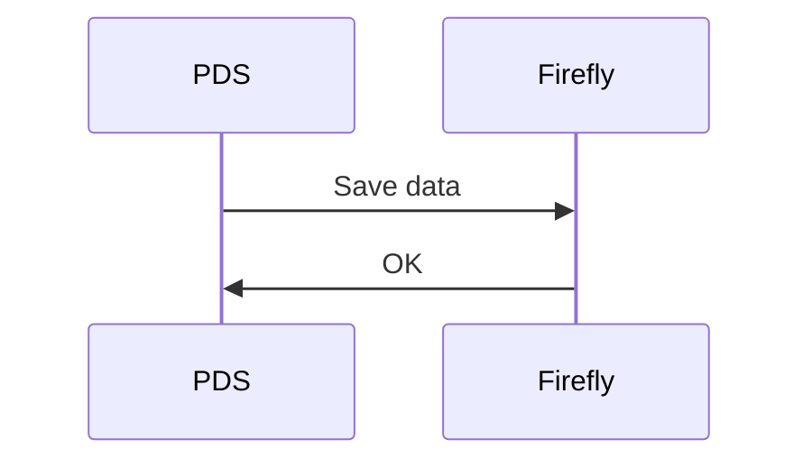
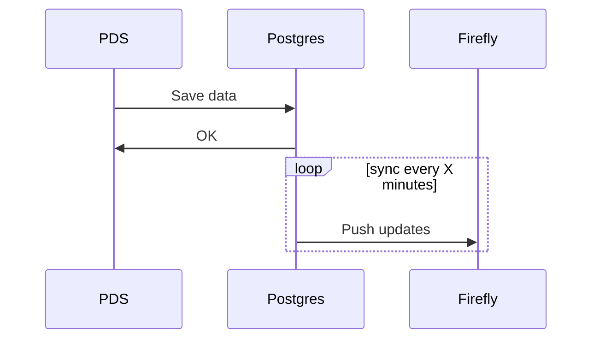
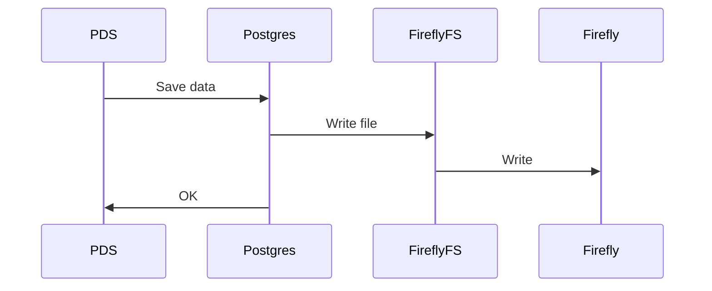

# Replace postgres with Firefly

In this scenario postgres is replaced with Firefly. All data is stored and accessed through the Firefly API.
SQL queries are replaced with coresponding Firefly API calls.

Required SQL subset:

- SELECT
- SELECT DISTINCT
- INSERT
- DELETE
- WHERE
- LEFT JOIN
- INNER JOIN
- ON CONFLICT DO NOTHING
- ON CONFLICT DO UPDATE
- RETURNING
- COUNT
- LIMIT
- ORDER BY
- SUBQUERY

# Dump postgres to Firefly every X minutes

In this scenario postgres is used as main database and duplicated to Firefly once in X minutes.

Can be done as a cron job that runs pg_dump and saves everything to Firefly.

# Run postgres on top of FireflyFS

In this scenario postgres is used as main database that runs on FireflyFS.

Whe might need expand FireflyFS fuse integration to support more methods.
